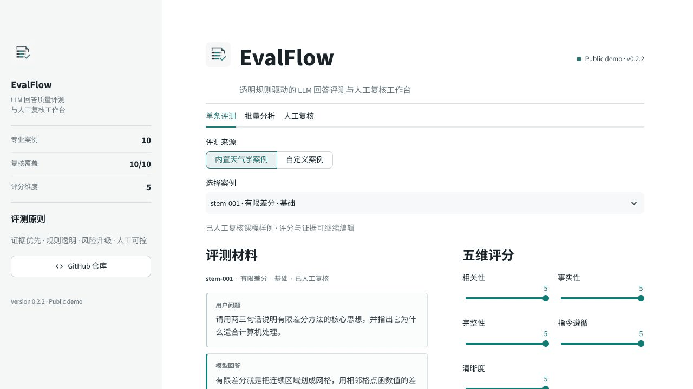
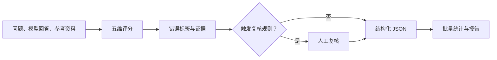
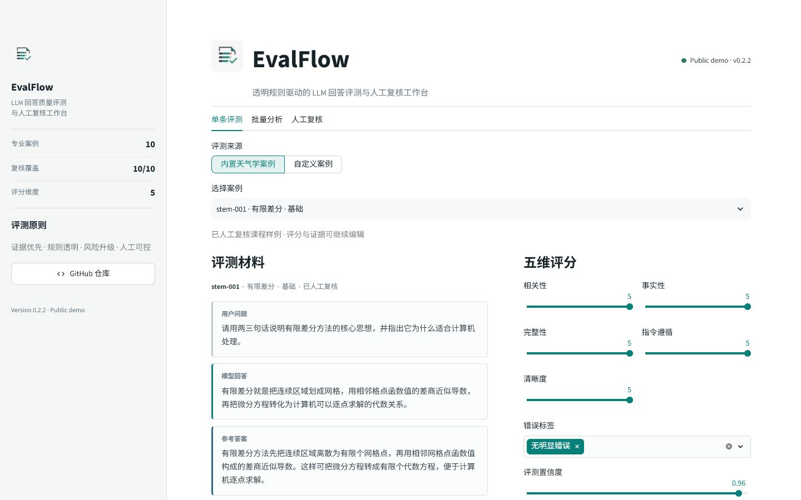
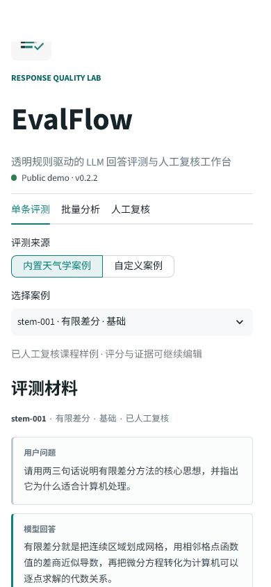

# LLM Response Evaluator

[](https://github.com/LazyS1a/llm-response-evaluator/actions/workflows/tests.yml)
[](https://github.com/LazyS1a/llm-response-evaluator/blob/main/CHANGELOG.md)
[](https://evalflow-llm-evaluator.streamlit.app)


面向 AI 训练师、LLM 评测和 AI 产品测试场景的评测工具。它将“这段回答好不好”转化为可解释、可校验、可批量统计的结构化流程，并提供可操作的 Streamlit 人工复核工作台与可安装的 Codex Skill。

<p align="center">
  
</p>

## 30 秒速览

| 项目证据 | 当前实现 |
| --- | --- |
| 评分规则 | 相关性、事实性、完整性、指令遵循、清晰度五维 1-5 分 |
| 错误分析 | 9 类错误标签，覆盖幻觉、信息遗漏、指令违规和引用错位等问题 |
| 人工复核 | 低置信度、低事实性和高风险案例自动进入人工确认 |
| 专业数据 | 10 条 PDF 页码可追溯的天气学 / STEM 样例，已全部人工复核 |
| Web 工作台 | 单条评测、批量统计、复核队列与 JSON / JSONL / Markdown 导出 |
| Prompt 实验 | V1 / V2 模板、20 条成对模拟输出和自动对比报告 |
| 工程验证 | 30 项自动测试，GitHub Actions 覆盖 Python 3.10 与 3.12 |

## 评测流程



Skill 负责依据规则判断回答质量；确定性的 Python 脚本负责格式校验、复核规则检查、数据集管理和批量汇总。

## EvalFlow Web 工作台

**在线体验**：[打开 EvalFlow](https://evalflow-llm-evaluator.streamlit.app)

- **单条评测**：加载已人工复核的天气学案例，或填写自定义问题、回答和参考答案。
- **批量分析**：读取 JSON / JSONL，查看维度均分、通过数量、错误分布和低分案例。
- **人工复核**：集中处理强制复核案例，修改评分并导出复核后的 JSONL。
- **结果导出**：下载结构化 JSON、汇总 JSON、Markdown 报告和复核数据集。
- **专业界面**：统一品牌视觉、只读评测材料、中文领域标签和响应式移动端布局。

内置评测只作为已人工复核的界面演示，不调用真实模型 API，也不宣称模型效果。

<details>
<summary>查看桌面端与移动端截图</summary>

<table>
  <tr>
    <td width="72%"></td>
    <td width="28%"></td>
  </tr>
</table>

</details>

<details>
<summary>本地开发运行</summary>

```powershell
python -m pip install -r requirements.txt
python -m streamlit run streamlit_app.py
```

启动后按终端显示的本地地址访问。

</details>

## 核心能力

- 对模型回答进行五维评分，并为每项判断提供可观察证据。
- 标注幻觉、无依据声明、答非所问、信息遗漏、指令违规和引用错位等错误。
- 对低置信度、低事实性、安全风险和引用错位案例强制要求人工复核。
- 校验单条 JSON 或批量 JSONL 的字段、分数、标签和复核逻辑。
- 汇总维度均分、通过数量、人工复核数量、错误标签和低分案例。
- 从专业 PDF 构造保留文件名与页码的可追溯评测样例。
- 管理 Prompt 版本、成对输出，并自动生成 V1 / V2 对比报告。

## 可查看的结果

- [通用样例评测报告](outputs/sample_report.md)
- [天气学 / STEM 人工复核表](outputs/stem_human_review.md)
- [模拟 Prompt V1 / V2 对比报告](outputs/simulated_prompt_comparison.md)
- [数据集覆盖统计](outputs/stem_coverage.json)

其中 Prompt V1 / V2 数据是透明标注的流程演示，用于验证成对输出、评分和汇总链路，不代表真实模型基准成绩。

## 版本与更新

- 当前版本：**v0.2.2**
- 完整变更记录：[CHANGELOG.md](CHANGELOG.md)
- 版本号遵循语义化版本：新增兼容功能升级次版本，破坏性变更升级主版本。

## 项目结构

```text
llm-response-evaluator/
├── .github/workflows/tests.yml
├── .streamlit/config.toml
├── CHANGELOG.md
├── VERSION
├── assets/evalflow-mark.png
├── app_core.py
├── streamlit_app.py
├── docs/
│   └── screenshots/
├── requirements.txt
├── skills/llm-response-evaluator/
│   ├── SKILL.md
│   ├── agents/openai.yaml
│   ├── references/
│   │   ├── rubric.md
│   │   ├── output-schema.md
│   │   └── stem-case-schema.md
│   └── scripts/
│       ├── validate_evaluations.py
│       ├── validate_stem_cases.py
│       ├── build_stem_review_sheet.py
│       ├── mark_stem_review.py
│       ├── build_prompt_simulation.py
│       ├── compare_prompt_versions.py
│       └── summarize_evaluations.py
├── data/
├── experiments/
├── examples/
├── outputs/
├── sources/
└── tests/
```

## 快速验证

核心校验与汇总脚本仅依赖 Python 3.10+ 标准库；Web 工作台使用 Streamlit。

```powershell
python -m unittest discover -s tests -v

python skills/llm-response-evaluator/scripts/validate_evaluations.py `
  data/sample_evaluations.jsonl

python skills/llm-response-evaluator/scripts/summarize_evaluations.py `
  data/sample_evaluations.jsonl `
  --json-out outputs/sample_summary.json `
  --markdown-out outputs/sample_report.md
```

<details>
<summary>展开完整 STEM 与 Prompt 实验命令</summary>

```powershell
python skills/llm-response-evaluator/scripts/validate_stem_cases.py `
  data/stem_cases.jsonl `
  --coverage-out outputs/stem_coverage.json

python skills/llm-response-evaluator/scripts/build_stem_review_sheet.py `
  data/stem_cases.jsonl `
  data/stem_draft_evaluations.jsonl `
  --output outputs/stem_human_review.md

python skills/llm-response-evaluator/scripts/build_prompt_simulation.py `
  data/stem_cases.jsonl `
  data/stem_draft_evaluations.jsonl `
  --outputs-out outputs/simulated_prompt_outputs.jsonl `
  --evaluations-out outputs/simulated_prompt_evaluations.jsonl

python skills/llm-response-evaluator/scripts/compare_prompt_versions.py `
  outputs/simulated_prompt_evaluations.jsonl `
  --json-out outputs/simulated_prompt_comparison.json `
  --markdown-out outputs/simulated_prompt_comparison.md
```

</details>

## 在 Codex 中使用

Skill 入口文件：[skills/llm-response-evaluator/SKILL.md](skills/llm-response-evaluator/SKILL.md)

将 `skills/llm-response-evaluator` 复制到个人 Skills 目录并重启 Codex，然后输入：

```text
使用 $llm-response-evaluator，根据给定参考资料评测这段模型回答，并返回结构化 JSON。
```

## 证据边界

- 当前数据用于验证评测工具链，不代表生产数据、真实用户规模或线上业务效果。
- 天气学参考答案来自本地课程 PDF 的页码级核对，原 PDF 不随仓库分发。
- 模拟 Prompt 对比不能用于宣称真实模型准确率或效果提升。
- Web 工作台不调用实时模型 API，自定义结果由评测人员填写并通过确定性规则校验。

## 后续升级

- 接入真实模型原始输出进行盲测对比。
- 增加 CSV 导入导出。
- 记录双人标注差异与一致性。
- 增加按任务类型配置的评分规则。
